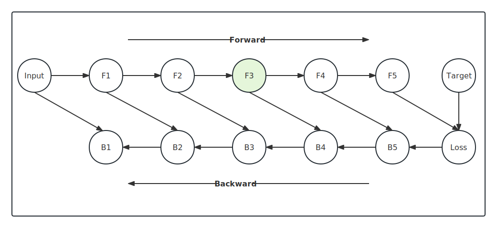

# Gradient Checkpointing Mechanism

Assuming that we have a sequential neural network with 5 layers below

## Memory Rich Method

Under general neural networks circumstances, the intermediate activations will only be freed when
the corresponding backward reaches. So when  forward passing completed, we will reach the memory
costing peak: 5 activations + Loss + input. 

And then perform backward propagation
- Using F5 and Loss to compute B5, free F5 and Loss
- Using F4 and B5 to compute B4, free F4 and B5
- ...

Memory consumption of this method is proportional to the number of network layers, denoted by $O(n)$,
without extra forward passing recomputing.

## Memory Poor Method

What if we release the activation as soon as possible, which means free F1 once F2 computation is done.
Within this circumstance, when we complete the forward passing, we only have Loss without any intermediate
activations. But when we do backward propagation, we have to recompute activations from input.

Forward
- Compute F1 from input
- Compute F2 from F1, free F1
- Compute F3 from F2, free F2
- ...

Backward
- Redo forward passing to F5 from input, compute B5 from F5 and Loss, free F5 and Loss
- Redo forward passing to F4 from input, compute B4 from F4 and B5, free F4 and B5
- ...

Memory cost will be $O(1)$, but computation cost will be $O(n^2)$ since we recomputing the forward
passing again and again.

## Gradient Checkpointing

Gradient checkpointing is a trade-off strategy among the above two methods. Checkpointing neither
saves all activations nor none, only saves several activations. When we do backward propagation,
recompute forward passing from the nearest checkpoint with all intermediate activation alive.

Suppose we set F3 as a checkpoint.

Forward
- Compute F1 from input
- Compute F2 from F1, free F1
- Compute F3 from F2, free F2
- Compute F4 from F3, **do-not** free F3. It's a checkpoint
- Compute F5 from F4, free F4
- Compute Loss From F5, free F5

Backward
- Redo forward to F5 from F3(checkpoint), keep all intermediate activations(F4) alive
  - Compute B5 from F5 and Loss, free F5 and Loss
  - Compute B4 from F4 and B5, free F4 and B5.
- Compute B3 from F3 and B4, free F3 and B4
- Redo forward to F2 from input, keep all intermediate activations(F1) alive
  - Compute B2 from F2 and B3, free F2 and B3
  - Compute B1 from F1 and B2, free F1 and B2

We could see the memory peak : input + F3 + one extra(forward state or backward state).
The extra forward recomputing: F3 -> F5, input -> F2.
If we set a checkpoint every $\sqrt{n}$ layers, the memory peak will be $O(\sqrt{n})$,
and the extra forward recomputing will be $O(n)$.

## Conclusion

Assuming we have a n-layer sequential neural network.

| Strategy            | Memory        | Re-computation |
|---------------------|---------------|----------------|
| Memory Rich         | $O(n)$        | $O(0)$         |
| Memory Poor         | $O(1)$        | $O(n^2)$       |
| Gradient Checkpoint | $O(\sqrt{n})$ | $O(n)$         |
